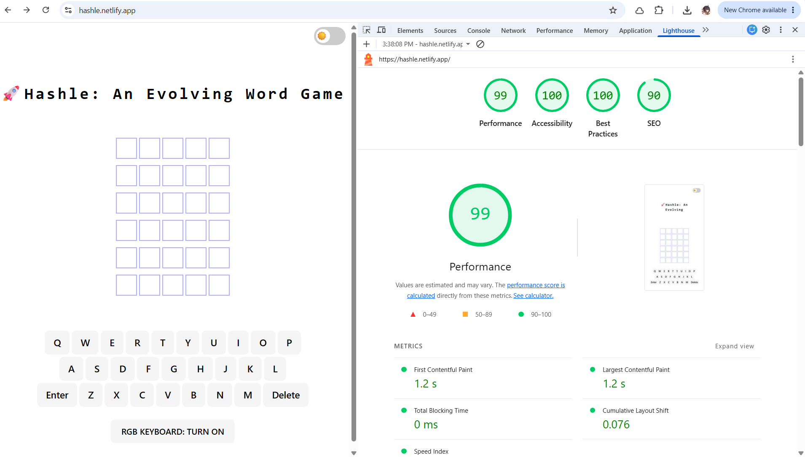

# Hashle: Decode the Words



**Gold standard.** 99 Performance, 100 Accessibility, 100 Best Practices, 90 SEO — Lighthouse doesn't grade on a curve.

The codebase is clean: zero ESLint errors, full unit/component/E2E test coverage passing. Claude can attest — reviewed the source directly, not just taking the README's word for it.

A Wordle-style word game built with React, Vite, and Tailwind CSS.

Hashle began as an elaboration of Scrimba's Hangman game. Hangman introduces some particularities of local state in a React component. The Scrimba Hangman "Assembly"-themed game from the capstone is a fun exercise in Hooks and local state, but not very DRY or modular code.

I built from these patterns and used a brute force approach, then refactored the codebase into more modular/DRY code using some agentic guidance from Cursor tools in helping with patterns. This surfaced a couple of bugs, which I fixed. I spent a while studying the more modular codebase. The monolith component has been refactored into custom Hooks and pure functions to make it easier to continue with testing.

## ✅ Testing

**50/50 unit/component/accessibility tests passing · 24/24 E2E tests passing (Chromium, Firefox, WebKit)**

The test suite was set up early, but it went unvalidated for a while — and it turned out to be silently broken: 7 of 18 tests were failing because a required setup file was never actually being loaded, so `@testing-library/jest-dom` matchers didn't exist. Fixing that immediately surfaced a real, previously-invisible accessibility bug (an empty `<h2>` used for a live status announcement — a genuine axe violation). From there: added targeted unit tests for the core duplicate-letter scoring logic (previously zero coverage on the highest-risk function in the app), built out Playwright from scratch, migrated to pnpm and Tailwind CSS 4, and — once a deferred manual smoke test actually got done — found and fixed two real cross-browser layout bugs (a header overflow issue and a Tailwind cascade-layers issue silently breaking every button's styling in the app).

Full writeup: **[docs/TESTING.md](./docs/TESTING.md)** (test details) · **[docs/DEPENDENCY-UPGRADES.md](./docs/DEPENDENCY-UPGRADES.md)** (pnpm/Tailwind 4 + the bugs that surfaced from them).

## Getting Started

```bash
pnpm install
pnpm run dev       # start the dev server
pnpm test          # run the unit/component test suite
pnpm exec playwright test   # run the E2E suite
pnpm run build      # production build
```

## Documentation

- [Testing](./docs/TESTING.md) — current test suite status, what's still open, how to run everything
- [Dependency Upgrades](./docs/DEPENDENCY-UPGRADES.md) — the pnpm and Tailwind CSS 4 migrations
- [Architecture Notes](./docs/ARCHITECTURE.md) — technical debt, backend tradeoffs under consideration, recommended next steps
