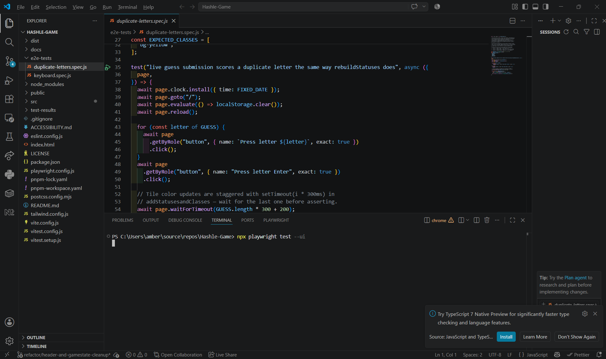
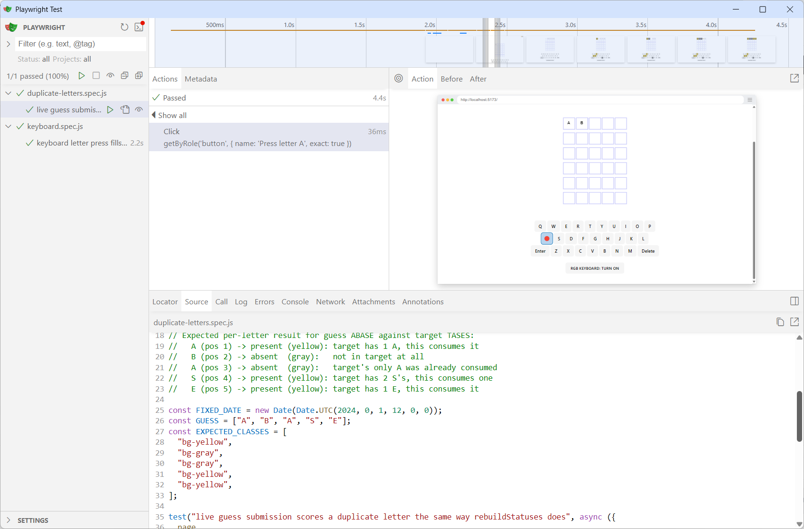

# Testing

## ⚙️ Still Open

- Add unit-level coverage for `addStatusesandClasses` (the live-guess coloring path in `useWordLogic.js`) directly, not just via the one E2E case — it's currently only checked against a single duplicate-letter scenario.
- Reproduce and guard against the reported all-gray-row bug specifically — see the open question below.
- Run axe-core against more states of the app (mid-game, win, loss), not just initial render.
- Prioritize deeper test coverage because Hashle is small enough to serve as a focused testing practice project.

## Screenshots

VS Code, running the E2E suite directly against `duplicate-letters.spec.js`:



Playwright's UI mode, same test passing, with the timeline and live app preview showing the on-screen keyboard mid-run:



## ✅ Testing Progress (2026-07-25)

Set up Vitest, axe-core, and Playwright originally, but the suites needed review and validation before they meant anything. Here's what that turned up:

- **The existing test suite was silently broken.** `vitest.config.js` only loaded `vitest.setup.js`, never `src/setupTests.js` — so the `@testing-library/jest-dom` matchers (`toHaveAttribute`, etc.) that the accessibility tests depend on were never registered. 7 of 18 tests were failing for that reason alone. Fixed by loading both setup files.
- **That fix immediately surfaced a real accessibility bug**, previously invisible because the test asserting on it was broken too: the game-status announcement was rendered as an `<h2>` that's empty by default (no message until a game is won or lost) — an empty heading is a genuine axe violation, since screen-reader users navigating by heading structure would hit a heading with no text. Fixed by changing it to `<div role="status">`, which is also the more correct element for a transient live-region announcement in the first place. Updated the one existing test that had encoded the wrong assumption — it only checked an `<h2>` existed, never checked it had content, which is why it never caught this.
- **Added unit tests for `rebuildStatuses.js`** (`src/utils/rebuildStatuses.test.js`) — the core duplicate-letter scoring logic, previously untested. 8 targeted cases: exact match, no match, a duplicate letter exceeding the target word's count (the classic Wordle-clone bug), green-before-yellow pass ordering, and keyboard-key-status not downgrading across guesses. All pass — the algorithm was correct, it just had zero coverage proving it.
- **Playwright was half set up.** No `playwright.config.js` existed despite the dependency being installed, and the one E2E spec pointed at the wrong port with an unfinished assertion. Added the config, fixed the spec, and added `duplicate-letters.spec.js` — an E2E test that submits a real duplicate-letter guess through the UI and checks it scores the same way the (now-verified) `rebuildStatuses` logic says it should. This matters because there are two independent implementations of the same coloring algorithm in this codebase: `rebuildStatuses.js` (only used when the board reloads from localStorage) and `addStatusesandClasses` inside `useWordLogic.js` (used for every live guess — never tested before this). The E2E test confirmed they agree on this case.
- **Open question, not yet resolved:** a user reported an all-gray guess row that shouldn't have been possible given the word list. The live-vs-rebuilt implementation divergence is now ruled out as the cause for the tested case. The stronger remaining hypothesis is `getDayIndex()` computing the daily word boundary from local `Date.now()` with no timezone/day-rollover defensiveness — a classic "happened once, near midnight, never reproduced" bug shape. Not confirmed yet.

## ✅ UI/Layout Fixes (2026-07-25)

A manual smoke test (deliberately deferred from the dependency-upgrade merge — see [DEPENDENCY-UPGRADES.md](./DEPENDENCY-UPGRADES.md)) turned up two real, distinct layout bugs, both root-caused and fixed rather than patched around:

- **Header title cut off / overflowing its container.** The CSS `steps()`-based typewriter effect was replaced with a JS-driven one (`src/hooks/useTypewriter.js`) — grapheme-safe via `Array.from()`, so it can't split the 🚀 emoji mid-character, and it doesn't depend on font-metric/step-count math the old technique needed to line up exactly (it never reliably did — a pre-existing Safari-specific step-count override was the tell). Removing the old CSS's `overflow: hidden` then exposed a second, previously-masked bug: `.terminal-container`'s `max-width: 690px` was always too narrow for the actual title string (~910px needed) — fixed by widening it and centering the `<h1>` properly. Also found and removed the likely real origin of the original cutoff report: an explicit `ipad:w-[23ch]` character cap (only active 768–1024px) that landed almost exactly at "...Evolving W".
- **On-screen keyboard row wrapping instead of staying on one line** (caught via a live screenshot at 434px width). Root cause: a legacy `button {}` reset rule in `index.css` was **unlayered CSS** — per the CSS Cascade Layers spec, unlayered styles always beat `@layer`'d styles regardless of specificity, and all of Tailwind's utilities live in `@layer utilities`. That one rule was silently overriding every Tailwind class applied to any button in the app (computed padding was 19.2px from the legacy rule instead of Tailwind's intended 8px). Fixed by wrapping the legacy rule in `@layer base`, which is exactly what Tailwind's layer system is for.
- **Cross-browser verified, not just Chrome.** Added Firefox and WebKit as Playwright projects (`playwright.config.js`) — both were already installed locally. WebKit is a useful proxy for Safari rendering (not identical to real macOS/iOS Safari).
- **Removed a now-dead macOS-specific workaround**, verified empirically before removing: `App.jsx` had a UA-sniffing effect that added a `mac-fix` body class, consumed by one CSS rule bumping the header container's max-width for Mac users. This was compensating for the old broken typewriter. Confirmed via WebKit that it's no longer needed — WebKit's actual rendered title width (698.9px) is *narrower* than Chromium's (~907.6px) for the identical string, so the base container width already has plenty of room. Removed both the JS effect and the CSS rule; full suite re-verified across all 3 engines afterward.
- Added `e2e-tests/layout.spec.js` (6 tests × 3 engines = 18 checks) — this whole class of bug (content overflowing its container, cascade-layer precedence) is invisible to the unit suite, since jsdom doesn't do real CSS layout or cascade resolution. Real-browser-only coverage, on purpose.

Current state: **31/31 unit/component/a11y tests passing, 24/24 E2E tests passing (8 tests × 3 engines: Chromium, Firefox, WebKit).**

## Running the suites

```bash
pnpm test              # unit/component tests, run once
pnpm run test:watch    # unit/component tests, watch mode
npx vitest --ui        # interactive UI for stepping through unit tests
pnpm exec playwright test                       # E2E, all 3 engines, headless
pnpm exec playwright test --ui                  # E2E, interactive step-through
pnpm exec playwright test --project=webkit      # E2E, one engine only (also: chromium, firefox)
```
